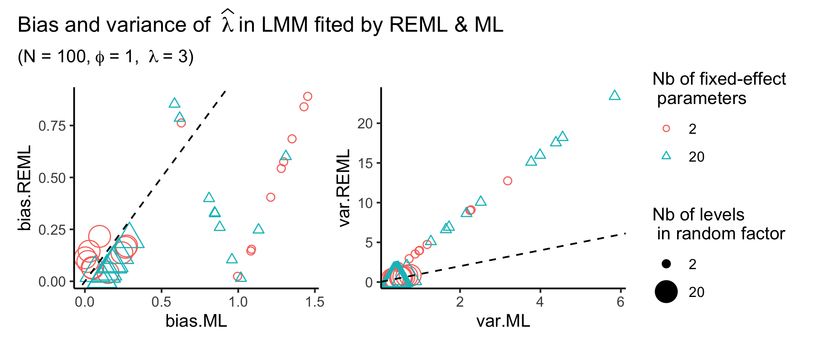

```{r setup, include=FALSE}
knitr::opts_chunk$set(fig.width = 5, fig.height = 5, fig.align = "center")
                      #cache = TRUE, cache.path = "./cache/", fig.path = "./figs/")
#library(spaMM) ## duplicate from next chunk for knitr cache
```

# Before we start

## Loading spaMM
```{r, message=FALSE}
library(spaMM)
print(citation("spaMM"), style = "text")
```

I will use the R package **spaMM** for fitting LMs and LMMs.

The R package spaMM can fit LMs, LMMs, GLMs, GLMMs and more, using the same function and producing consistent outputs irrespective of the model.

Well known alternatives for fitting LMMs are:

- **lme4** (for simple LMMs and GLMMs)
- **glmmTMB** (for LMs, LMMs, GLMs, GLMMs)


## Content

- A simple example: fitting the yield of oats
- Beyond the simple case
- 10 practical considerations
- General conclusion


# A simple example: fitting the yield of oats

## The Oats dataset
```{r}
data("Oats", package = "nlme") ## load a dataset from the pkg nlme
Oats$Block <- factor(Oats$Block,       ## original data from nlme have ordered factors, so we
                     ordered = FALSE,  ## remove the ordering not to trigger unusual contrasts
                     levels = c("I", "II", "III", "IV", "V", "VI"))
head(Oats, n = 14) ## display first 14 rows
```


## The Oats dataset
```{r}
Oats$yield
Oats$nitro
table(Oats$Variety, Oats$Block)
```


## The Oats dataset
```{r}
coplot(yield ~ nitro | Variety + Block, data = Oats)  ## simple native plot showing it all
```


## Fitting the yield of oats using a LM
```{r}
(fit_oats_fixed <- fitme(yield ~ nitro + Variety + Block, data = Oats))
```


## Fitting the yield of oats using a LMM
```{r}
(fit_oats_mixed <- fitme(yield ~ nitro + Variety + (1|Block), data = Oats))
```


## Parameters in LM & LMM

The effect of `Block` is modelled by:

- 5 means for `fit_oats_fixed` corresponding to each block level (but the one from the intercept)
- 1 variance for `fit_oats_mixed` corresponding to the variable `Block`

The variance is that of a distribution of the means block effects:

```{r, fig.height = 3, fig.width = 4, echo=FALSE}
par(mar = c(4, 4, 0.1, 0.1))
rnf <- ranef(fit_oats_mixed)[[1]]
curve(dnorm(x, mean = 0, sd = sqrt(get_ranPars(fit_oats_mixed)$lambda)[[1]]), -50, 50, ylab = "density", xlab = "random effect", ylim = c(0, 0.035), las = 1)
```

Note: the distribution is centered around 0 (by construction) and considered gaussian.

## Interpretation in LM & LMM

### LM:

compared to the average yield of block I, 

- block II increases the average yield by `r round(fixef(fit_oats_fixed)["BlockII"][[1]], digits = 2)`
- block III increases the average yield by  `r round(fixef(fit_oats_fixed)["BlockIII"][[1]], digits = 2)`
- block IV increases the average yield by  `r round(fixef(fit_oats_fixed)["BlockIV"][[1]], digits = 2)`
- block V increases the average yield by  `r round(fixef(fit_oats_fixed)["BlockV"][[1]], digits = 2)`
- block VI increases the average yield by  `r round(fixef(fit_oats_fixed)["BlockVI"][[1]], digits = 2)`


### LMM:

each block modifies the average yield by a specific (unknown) value drawn from $\mathcal{N}(\mu = 0, \sigma = `r round(sqrt(get_ranPars(fit_oats_mixed)$lambda[[1]]), digits = 2)`)$

Note: $`r round(sqrt(get_ranPars(fit_oats_mixed)$lambda[[1]]), digits = 2)` = \sqrt{`r round(get_ranPars(fit_oats_mixed)$lambda[[1]], digits = 2)`}$


## The effect of blocks in LMM

To infer the effect of blocks,

- you can predict the effect of the observed blocks by computing the mean of the random effects conditional to the observed data:

<br />

```{r}
ranef(fit_oats_mixed)
```

<br />

**Note**: <span style="color:rgb(255,0, 0)"> also possible in LM </span> (although fitted, not predicted)


## The effect of blocks in LMM

To infer the effect of blocks,

- you can predict the effect of the observed blocks by computing the mean of the random effects conditional to the observed data:

<br />

```{r, fig.height = 3, fig.width = 4, echo=FALSE}
par(mar = c(4, 4, 0.1, 0.1))
rnf <- ranef(fit_oats_mixed)[[1]]
curve(dnorm(x, mean = 0, sd = sqrt(get_ranPars(fit_oats_mixed)$lambda)[[1]]), -50, 50, ylab = "density", xlab = "random effect", ylim = c(0, 0.035), las = 1)
points(dnorm(rnf, mean = 0, sd = sqrt(get_ranPars(fit_oats_mixed)$lambda)[[1]]) ~ rnf, col = "blue", type = "h")
points(dnorm(rnf, mean = 0, sd = sqrt(get_ranPars(fit_oats_mixed)$lambda)[[1]]) ~ rnf, col = "blue")
text(dnorm(rnf, mean = 0, sd = sqrt(get_ranPars(fit_oats_mixed)$lambda)[[1]]) + 0.0025 ~ rnf,
    labels = names(rnf), col = "blue", cex = 0.5)
```


## The effect of blocks in LMM

To infer the effect of blocks,

- you can predict the effect of the observed blocks by computing the mean of the random effects conditional to the observed data
- you can predict the effect of an average new block: its effect is 0 and associated with a larger uncertainty:

<br />

```{r}
fixpred_V0N <- predict(fit_oats_mixed, newdata = data.frame(Variety = "Victory", nitro = 0), re.form = NA)[[1]]
```

```{r}
## sampled level (-> same as ranef())
predict(fit_oats_mixed, newdata = data.frame(Block = "II", Variety = "Victory", nitro = 0))[[1]] - fixpred_V0N
get_intervals(fit_oats_mixed, newdata = data.frame(Block = "II", Variety = "Victory", nitro = 0)) - fixpred_V0N
```


## The effect of blocks in LMM

To infer the effect of blocks,

- you can predict the effect of the observed blocks by computing the mean of the random effects conditional to the observed data
- you can predict the effect of an average new block: its effect is 0 and associated with a larger uncertainty:

<br />

```{r}
fixpred_V0N <- predict(fit_oats_mixed, newdata = data.frame(Variety = "Victory", nitro = 0), re.form = NA)[[1]]
```

```{r}
## non-sampled level
predict(fit_oats_mixed, newdata = data.frame(Block = "VII", Variety = "Victory", nitro = 0))[[1]] - fixpred_V0N
get_intervals(fit_oats_mixed, newdata = data.frame(Block = "VII", Variety = "Victory", nitro = 0)) - fixpred_V0N
```


## Fixed vs Random effects for observed blocks

```{r, echo=FALSE, fig.width = 4, fig.height = 4}
par(mar = c(4, 4, 0.1, 0.1))
plot(fixef(fit_oats_fixed)[5:9],
     ranef(fit_oats_mixed)[[1]][-1] - ranef(fit_oats_mixed)[[1]][1],
     asp = 1, xlim = c(-50, -20), las = 1,
     xlab = "fixed", ylab = "random", col = NULL)
text(fixef(fit_oats_fixed)[5:9],
     ranef(fit_oats_mixed)[[1]][-1] - ranef(fit_oats_mixed)[[1]][1],
     labels = names(ranef(fit_oats_mixed)[[1]][-1]))
abline(0, 1, lty = 2)
```

**Note**: random effects are shrunk towards the mean (i.e 0). The **shrinkage** will increase with the uncertainty associated with random effect estimates, so more observations per block would reduce it! Here the random effects are aligned because data are balanced across blocks.

See also: https://m-clark.github.io/posts/2019-05-14-shrinkage-in-mixed-models/


## Conclusion {.build}

<div>
This simple example already illustrates key points about mixed models:

- they allow for the estimation of one variance (or several ones in more complex models)

- fewer parameters need to be estimated

    $\rightarrow$ having a large number of blocks would not not be an issue in LMM, but it would be in LM
</div>

<div>
- one additional assumption: the random effects are drawn from a gaussian distribution

- the more levels you have, the more accurate the estimate of the variance

- the more observations per level you have, the more accurate the prediction of each random effect
</div>

<div>
- predictions & simulations for unobserved levels are possible

- predictions for an average block are directly given by the fixed effects (in LMM only; not in GLMM)
</div>


# Beyond the simple case

## Simple generalisation

- you can model several variances (useful to compare them!):

```{r}
fitme(yield ~ nitro + (1|Variety) + (1|Block), data = Oats) ## I would not do that here (only 3 varieties!)
```


## Simple generalisation

- you can model several variances
- the random effects can be added to fixed effect(s) other than the intercept $\rightarrow$ random slope model:

```{r}
fitme(yield ~ nitro + Variety + (nitro|Block), data = Oats)
```


## Advanced generalisation

In our example `fit_oats_mixed`, the random effects were modelled as:

$$
b \sim
\mathcal{N}\left(0,
\begin{bmatrix}
\lambda & 0 & 0 & \dots & 0 \\
0 & \lambda & 0 & \dots & 0 \\
0 & 0 & \lambda & \dots & 0 \\
\vdots & \vdots & \vdots & \ddots & \vdots \\
0 & 0 & 0 & \dots & \lambda \\
\end{bmatrix}\right)
$$

This representation highlights a square symmetric matrix called the **covariance matrix**, for which the number of rows (and columns, since it is a square) is equal to the number of levels for the grouping variable.

In this simple case,

- the diagonal elements of the covariance matrix are all the same and modelled as a **single variance** ($\lambda$)

- the off-diagonal elements of the covariance matrix are 0, which implies that the random effects associated with different levels are **not correlated**

**Conclusion**: this is a very simple random-effects structure for a mixed model


## Advanced generalisation

In general terms, the random effects can be modelled as:

$$
b \sim
\mathcal{N}\left(0,
\begin{bmatrix}
c_{1,1} & c_{1,2} & c_{1,3} & \dots & c_{1,q} \\
c_{2,1} & c_{2,2} & c_{2,3} & \dots & c_{2,q} \\
c_{3,1} & c_{3,2} & c_{3,3} & \dots & c_{3,q} \\
\vdots & \vdots & \vdots & \ddots & \vdots \\
c_{q,1} & c_{q,2} & c_{q,3} & \dots & c_{q,q} \\
\end{bmatrix}\right)
$$

Departure from the simple model:

- the variances used to draw each level can differ
- the covariances between levels don't have to be null

<br />

**Note**: in general, the parameters $c_{i,j}$ are not distinctly estimated but generated by a covariance (or correlation) function ($c_{i, j} = g(i, j, \theta)$) which depends on a smaller number of parameters to be estimated


## Example: modeling spatial autocorrelation

```{r}
data("Loaloa")
ndvi <- Loaloa[, c("maxNDVI", "latitude", "longitude")]
head(ndvi, n = 14)
```


## Example: modeling spatial autocorrelation

```{r, fig.width = 9}
spaMMplot2D(x = ndvi$longitude, y = ndvi$latitude, z = ndvi$maxNDVI, add.map = TRUE,
            xlab = "Longitude", ylab = "Latitude", plot.title = title(main = "max NDVI"))
```


## Example: modeling spatial autocorrelation

```{r}
(fit_loaloa <- fitme(maxNDVI ~ 1 + Matern(1|longitude + latitude), data = ndvi))
```


## Example: modeling spatial autocorrelation

```{r, fig.height=3.5}
fit_loaloa_km <- fitme(maxNDVI ~ 1 + Matern(1|longitude + latitude), data = ndvi,
                       control.dist = list(dist.method = "Euclidean")) # default distance method
par(mar = c(4, 4, 0.1, 0.1))
plot(seq(0, 3, by = 0.1),
     MaternCorr(d = seq(0, 3, by = 0.1),
                rho = get_ranPars(fit_loaloa, which = "corrPars")[[1]]$rho,
                nu = get_ranPars(fit_loaloa, which = "corrPars")[[1]]$nu),
     type = "l", xlab = "Distance (degree)", ylab = "Correlation", ylim = c(0, 1), las = 1)
```


## Example: modeling spatial autocorrelation

```{r, fig.height=3.5}
fit_loaloa_km <- fitme(maxNDVI ~ 1 + Matern(1|longitude + latitude), data = ndvi,
                       control.dist = list(dist.method = "Earth"))
par(mar = c(4, 4, 0.1, 0.1))
plot(seq(0, 350, by = 0.1),
     MaternCorr(d = seq(0, 350, by = 0.1),
                rho = get_ranPars(fit_loaloa_km, which = "corrPars")[[1]]$rho,
                nu = get_ranPars(fit_loaloa_km, which = "corrPars")[[1]]$nu),
     type = "l", xlab = "Distance (km)", ylab = "Correlation", ylim = c(0, 1), las = 1)
```


## Example: modeling spatial autocorrelation

```{r, fig.width = 9}
filled.mapMM(fit_loaloa, add.map = TRUE, plot.title = title(xlab = "Longitude", ylab = "Latitude"))
```

## Conclusion

This example of `fit_loaloa` illustrates additional benefits from mixed models:

- the effect of continuous processes can also be modelled by random effects

- particular structure of covariance matrices for the random effects can be used to relax the assumption of independence in LM

- mixed models can be used to estimate parameters of correlation (or covariance) functions, which has many applications:

    - estimating spatial and temporal processes
    - estimating various components of phenotypic variation (animal model)
    - estimating evolutionary models in phylogenetic analyses
    
      (Note: others methods such as GLS can do that too, but mixed models are statistically best)


# 10 practical considerations

## 1. Fix vs random

If you want to use a correlation function, or predict levels that you did not sample $\rightarrow$ **RANDOM**

<br />

Otherwise:

- if you have a very large number of levels in a factor $\rightarrow$ **RANDOM**
- if you have a very small number of levels in a factor $\rightarrow$ **FIX**

Note: whether a number is large or small must be assessed in comparison to the number of observations, but $\leq 4$ will almost certainty qualify as small

<br />

When it is not clear, consider that:

- mixed models make additional assumptions on your data
- mixed models are more difficult to handle (see next slides)
- you could fit both alternatives and compare the goodness of fit of the models (see Model comparison)


## 2. Random vs residual variance

In mixed models, we have more than one variance term.

For example, in `fit_oats_mixed` we have two variances:

```{r}
VarCorr(fit_oats_mixed)
```

<br />

Pay attention not too mix up (in your mind) the variance(s) of the random effects and the residual variance:

- if you want to model the changes in variances, use a GLM or an heteroscedastic model
- random effects are used (except in DHGLM) to model changes in means (albeit using a variance)
- in LMM you cannot have one different level of your grouping variable for each observation, unless you constrain the residual variance (in GLMM it is possible since the residual variance is related to the mean)


## 2. Random vs residual variance

Let's breakdown all components behind the first observation (= fixed effect + random effect + residual):
```{r, echo=FALSE}
Oats[1, ]
```

- Fixed effect:
```{r, fig.height = 3.5, fig.width = 4.5, echo=FALSE, message=FALSE}
library(ggplot2)
d <- data.frame(pred = predict(fit_oats_mixed, re.form = NA),
                nitro = Oats$nitro,
                Variety = Oats$Variety)
ggplot(d) +
  aes(y = pred, x = nitro, colour = Variety, shape = Variety) +
  geom_point() +
  geom_line() +
  geom_point(y = predict(fit_oats_mixed, re.form = NA)[1], x = 0, colour = "red", size = 5, inherit.aes = FALSE) +
  labs(y = "Predicted yield") + 
  theme_classic()
```


## 2. Random vs residual variance

Let's breakdown all components behind the first observation (= fixed effect + random effect + residual):
```{r, echo=FALSE}
Oats[1, ]
```

- Random effect:
```{r, fig.height = 3.5, fig.width = 4.5, echo=FALSE}
par(mar = c(4, 4, 0.1, 0.1))
rnf <- ranef(fit_oats_mixed)[[1]]
curve(dnorm(x, mean = 0, sd = sqrt(get_ranPars(fit_oats_mixed)$lambda)[[1]]), -50, 50, ylab = "density", xlab = "random effect", ylim = c(0, 0.035), las = 1)
points(dnorm(rnf, mean = 0, sd = sqrt(get_ranPars(fit_oats_mixed)$lambda)[[1]]) ~ rnf, col = "blue", type = "h")
points(dnorm(rnf, mean = 0, sd = sqrt(get_ranPars(fit_oats_mixed)$lambda)[[1]]) ~ rnf, col = "blue")
points(dnorm(rnf[1], mean = 0, sd = sqrt(get_ranPars(fit_oats_mixed)$lambda)[[1]]) ~ rnf[1], col = "red", pch = 20, cex = 4)
text(dnorm(rnf, mean = 0, sd = sqrt(get_ranPars(fit_oats_mixed)$lambda)[[1]]) + 0.0025 ~ rnf,
    labels = names(rnf), col = "blue", cex = 0.5)
```


## 2. Random vs residual variance

Let's breakdown all components behind the first observation (= fixed effect + random effect + residual):
```{r, echo=FALSE}
Oats[1, ]
```

- Residual:
```{r, fig.height = 3.5, fig.width = 4.5, echo=FALSE}
par(mar = c(4, 4, 0.1, 0.1))
res <- resid(fit_oats_mixed)
curve(dnorm(x, mean = 0, sd = sqrt(get_ranPars(fit_oats_mixed)$phi)[[1]]), -50, 50, ylab = "density", xlab = "residual", ylim = c(0, 0.035), las = 1)
points(dnorm(res, mean = 0, sd = sqrt(get_ranPars(fit_oats_mixed)$phi)[[1]]) ~ res, col = "blue", type = "h")
points(dnorm(res, mean = 0, sd = sqrt(get_ranPars(fit_oats_mixed)$phi)[[1]]) ~ res, col = "blue")
points(dnorm(res[1], mean = 0, sd = sqrt(get_ranPars(fit_oats_mixed)$phi)[[1]]) ~ res[1], col = "red", pch = 20, cex = 4)
```

## 3. Checking assumptions

Checking the assumptions of mixed models can be often difficult.

For the simple case (as in `fit_oats_mixed`), you may check the usual assumptions from LM as well as the QQ plot of the random effects predicted for the observed levels of the correspinding grouping variable.

You may use methods based on the simulation of residuals (e.g. using the package **DHARMa**), but although such methods seem appealing, they remain to be statistically evaluated.

An alternative or complementary approach is to compare the goodness of fit of models with different assumptions.


## 4. Likelihood computation

There 2 main fitting methods available to fit mixed models which differ in how likelihood is computed:

- Maximum Likelihood (ML)
- Restricted (or Residual) Maximum Likelihood (REML)

**ML** has been introduced in a context of fixed effects and remains ideal in LMM to fit such effects.

**REML** has been introduced to **reduce the bias in the ML estimation of variance components** (by accounting for the degrees of freedom used up by the estimation of fixed effects).

Yet, the REML estimator **can result in more uncertainty** (depending on the number of parameters, the number of observations and how balanced the observations are between the level of the grouping variable).

Because computing ML and REML is computationally costly in GLMM, **different approximations can be used**, e.g. **PQL** (the penalized quasi-likelihood).

Different settings also exist for a given approximation method :-(

Guessing what is best in a given situation is often difficult (even for those who know all the details there is to know about this) and would ideally require a custom simulation analysis.

**Conclusion**: spaMM & other packages offer a lot of choice, but what to do is often not obvious...


## 4. Likelihood computation

{#id .class width=100% height=100%}

## 4. Likelihood computation

Tips:

- interested in fixed effects only $\rightarrow$ **ML**
- interested in variances in a model with many fixed effect parameters $\rightarrow$ **REML**
- the larger the sample size $\rightarrow$ the smaller difference between estimates produced by **ML** and **REML**

<br />

**Notes**:

- packages such as spaMM or lme4 are trying to prevent you from doing silly things; e.g. they will complain or refit the models when `anova()` is called on fits adjusted with the "wrong" method
- beware when comparing likelihoods across packages that not all package use the same underlying formulas, even when you use the same method name


## 5. Optimizer for the likelihood function

Choosing between ML, REML, PQL... means choosing a mathematical function which value depends on the parameters the fit must estimate. The optimizer refers to the method used to **optimise** such a function, i.e. in how to find parameter values that maximise (or minimise) the lieklihood function.

One can thus choose between different optimizers such as:

- `nloptr`
- `bobyqa`
- `L-BFGS-B`

**Note**: those methods have not been developed with mixed models in mind (they are general tools)

Packages such as spaMM and lme4 let you choose among various optimizers, but also among various implementations of the same optimizers (i.e. which R package must do the job), and they let you tinker with many inputs adjusting how a given optimizer behave.

The reason why this choice is offered is precisely because **no optimizer is best in all situations** (an optimizer may be very slow, it may not succeed in converging, or it may converge toward wrong values).

**Tips**: trust the default settings which have been carefully selected by the developers and when you have problems, collect more data (it often helps) or ask *them* (not me) for help


## 6. Model comparison and significance testing

Comparing **nested models** is the usual way to identify which model fits the data the best and/or to test the effect of regressor(s).

There are 3 options when comparing model differing in their fixed-effect regressors:

- use an asymptotic likelihood ratio test (LRT) using the $\chi^2$ distribution for that (also via `anova()`)
- use a LRT for which the distribution of the LR statistic under H0 is simulated by parametric bootstrap (also via `anova()` in spaMM, or `pbkrtest::PBmodcomp()` in lme4) (the best approach for GLMMs)
- use an F-test with a particular computation of the degree of freedom (e.g. Kenward-Roger approximation) (`pbkrtest::KRmodcomp()` in lme4)

There are 2 options when comparing models differing in their random-effect structure:

- use a LRT by parametric bootstrap
- use Restricted LRT by parametric bootstrap (e.g. using `RLRsim::RLRTSim()` for the test of a single random-effects variance)

**Notes**: 

- even methods based on parametric bootstraps do not always behave well
- `summary()` outputs don't display p-values (by default) since the usual Wald test are not appropriate


## 7. Information-theoric metrics

You can compute the Akaike Information Criterion (**AIC**) but there is now 2 cases to distinguish:

- the computation of the marginal AIC = usual AIC = quantifies the predictive power of a model considering all possible realisations for the random effects (i.e. associated to sampled levels or not)
- the computation of the conditional AIC = quantifies the predictive power of a model considering only the particular (i.e. predicted) realisations of the random effects conditional to the sampled data

E.g. the cAIC is the metric of choice to identify the spatial model that best predict the distribution of the response (e.g. max NDVI) in one non-sampled locations

<br />

**Notes**:

- cAIC is not the same as AICc (AIC for small samples) which you may have encountered for LMs
- not many packages compute the cAIC but spaMM does


## 8. Computing predictions

You may compute:

- conditional predictions obtained by summing the fixed effect prediction to the the values predicted for the sampled realisation of the random effects $\rightarrow$ Best Linear Unbiased Predictions (BLUPs)

- unconditional predictions obtained by considering only the fixed effects (i.e. assuming a random effect of 0)

- marginal predictions obtained by integrating the sum of the fixed-effect predictor and a random effect over all possible values for such a random effect

<br />

**Notes**: 

- in LMM the last 2 computations lead to the same result, so in practice we just set the random effect to zero
- in GLMM the 2 options do differ and only the integration makes sense to obtain marginal predictions (even though it is rarely done)
- what is best depends on what you are using your predictions for


## 9. Computing intervals

When computing intervals, you have the possibility to include different sources of (co)variance/uncertainty:

- as in LM:
    - the (co)variances around fixed effect parameters
    - the residual variance
    - the uncertainty around the estimate(s) for the residual variance

- different from LM:
    - the uncertainty associated with the predictions of the random effects
    
        (e.g. uncertainty stemming from the variance estimate, but also from the estimates of the parameters of correlation function)

<br />

**Notes**: 

- what to consider depends on what you are using your interval for
- spaMM allows you to cherry pick exactly what you need (see `?predict.HLfit`)


## 10. GLMM

A generalised Linear Mixed-effect Models (**GLMM**) = **LMM** + **GLM**

There is (from the user point of view) no additional complexity emerging from the combination of both types of model.

Yet, it does combine the inherent complexity of LMMs (which we just detailed) to the (arguably greater) complexity of GLMs $\rightarrow$ how to best tests effects? how to check assumptions? how to compute predictions? become extremely tricky questions.

While many bad practices are known, best practices in the context of GLMM remain little investigated (it is a very general class of models).

Another form of generalisation offered by spaMM is to consider random effects that follow a non-gaussian distribution (many choices are possible, as in GLM)

<br />

**Tip:** learn how to do simulation studies and perform a simulation study for your particular situation


# General conclusion

## LMM in a nutshell

The core idea behind the LMM is relatively simple (although abstract when one tries to be both general and correct):

<p style="text-align: center">*a LMM is a linear model where model parameters are random variable(s)*</p>

It is and will probably remain for long the right tool for many engineering and scientific applications

The devil lies in the details of how to work with such a beast (and should not be in the interpretation of the number it gives you, be it parameter estimates, p-values, likelihood... those you should learn to master)

**Tips**: 

- explore LMs (and GLMs) in depth if you want to tackle LMMs (and GLMMs) properly
- if you have no particular interest in statistics and all you are doing is analysing the outcome of an experiment with a factor with 3 (or 4, or 5) levels (e.g.), stay away from mixed models!
- by the way: mixing models and mixed models are different beasts
- keep simulating & reading (package documentation, articles, books) even if you don't understand everything


## A note on semantics

In my presentation based on the following model,

```{r}
formula(fit_oats_mixed)
```

I chose to call **random effects** the values that can be drawn from the gaussian variable used to model the differences between blocks and I referred to the variable `Block` in the data as a **grouping variable**.

Others would instead have written/said that this model contains 1 random effect (or 1 random effect term or 1 random factor: `Block`) and use different wording to refer to what I have called **random effects** (e.g. realizations of the random effect).

A quick look at the literature did not lead to particular insights since authors tend to be precise when using maths and more inconsistent when using English.

I was tempted to use **random factor** to refer to `Block`, but that would not work for the model with `Matern(1|lat + long)`, which contains quantitative variables.
(Random variable is a little too vague since many random variables are involved in LMM)

This is a general issue in statistics.


## Session info {.smaller}

```{r, echo=FALSE}
sessionInfo()
```
