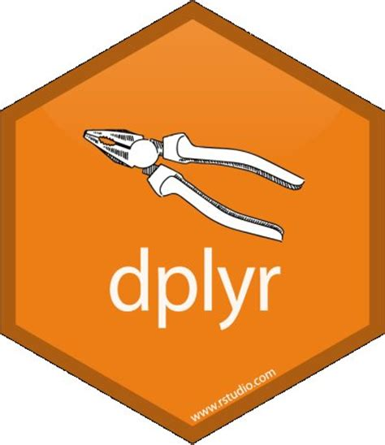
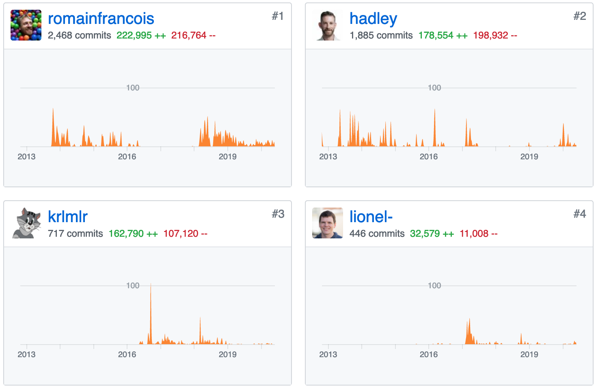
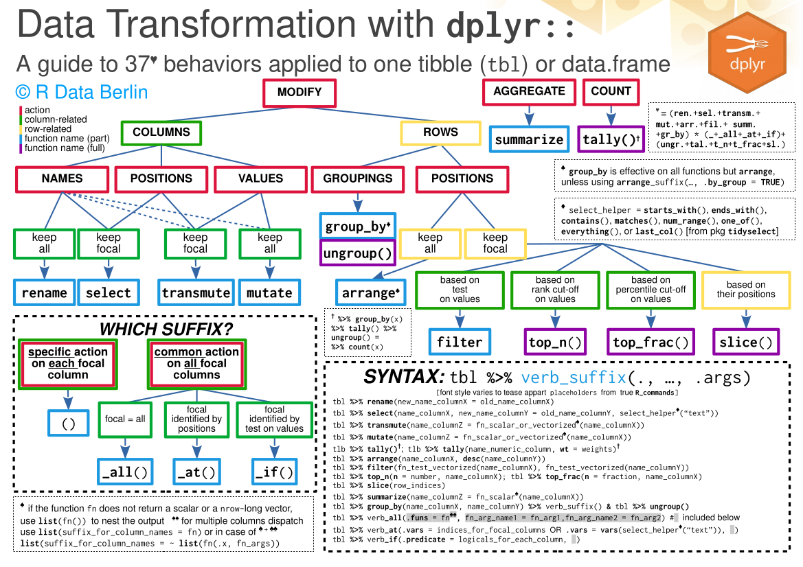
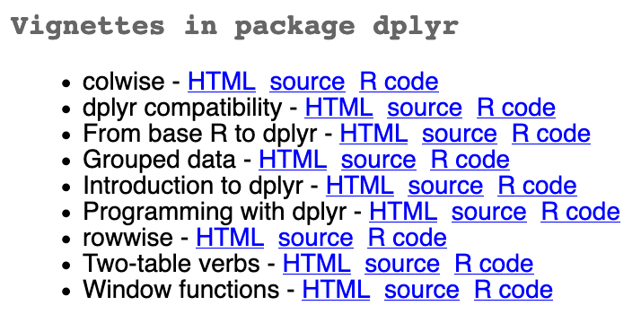
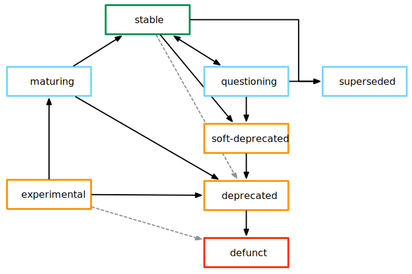

```{r setup, include=FALSE}
knitr::opts_chunk$set(echo = TRUE)
options(width = 110)
```

## A new major release of **{dplyr}** just came out...

```{r, eval = FALSE}
update.packages() ## to update your {dplyr} or install.packages("dplyr") for new users
```

<p>

</p>


<p>

</p>

<br></br>
<br></br>
<br></br>

<p><center> ... and I am going to tell you <del>all</del> about it </center></p>

<br></br>

Note: these slides are available here (as rmarkdown or HTML document): https://github.com/courtiol/Rcourses


## Preambule

Let's prepare some data for us to use during this session:

```{r, message=FALSE}
(iris_tbl <- tibble::as_tibble(iris)) ## turn the data into tibble for better display
```


# Introduction

## What is **{dplyr}**?

**{dplyr}** is a package dedicated to data manipulation: it makes usual operations on `data.frame` (including tibbles) easy to implement.

This includes:

- selecting columns with `select()`
- renaming columns with `rename()`
- creating columns with `mutate()`
- filtering rows with `filter()`
- aggregating rows with `summarise()`
- merging different `data.frame` with the `join_xxx()` functions

<br></br>

**{dplyr}** is one of the most widely used R package in the world!


## **{dplyr}** and the **tidyverse**

**{dplyr}** is the flagship package of the **tidyverse**, an ecosystem of packages developed by RStudio aiming to make R more accessible and modern.

```{r}
library(tidyverse) ## a minimal list
```


## **{dplyr}** and the **tidyverse**

**{dplyr}** is the flagship package of the **tidyverse**, an ecosystem of packages developed by RStudio aiming to make R more accessible and modern.

```{r}
tidyverse_packages() ## a larger, yet far from complete list
```

<br></br>

Note: see https://github.com/tidyverse for a full list


## Who write the code behind **{dplyr}**?

Hundreds of minor contributors + 4 key players are developing **{dplyr}**:

https://github.com/tidyverse/dplyr/graphs/contributors

<p>
<center>

</center>
</p>


## Short (pre)history of **{dplyr}**

**{dplyr}** version 1.0 is the result of 15 years of work by Hadley Wickham


| Relase date|   Package     |  Version | Description                                           |
|:----------:|:-------------:|:--------:|:-----------------------------------------------------:|
| 05/08/2005 | **{reshape}** |   0.4.0  | *"Flexibly reshape data"*                             |
| 08/10/2008 |  **{plyr}**   |   0.1.1  | *"Tools for splitting, applying and combining data"*  |
| 29/01/2014 |  **{dplyr}**  |   0.1.1  | *"dplyr: a grammar of data manipulation"*             |
| 29/05/2020 |  **{dplyr}**  |   1.0.0  |                                                       |

<!-- - 2008 Hadley finishes in PhD *"Practical tools for exploring data and models"*

- 2013 Hadley starts working at RStudio -->

<br></br>

Note: **{reshape}** and **{plyr}** are still (minimally) maintained despite being superseded by **{dplyr}** since many packages depend on them


## **{dplyr}** was slower to mature than other tidy pkgs

Several other core **tidyverse** packages have reached v1.0.0 a while ago:

e.g. 21/05/2014 for **{ggplot2}**, 30/04/2015 for **{stringr}**, 23/03/2016 for **{tibble}**

```{r, message = FALSE}
map_df(tidyverse_packages(), ~ set_names(packageVersion(.x), nm = "version")) %>%
  mutate(pkg = tidyverse_packages(), .before = 1) %>%
  filter(version > 1) %>%
  arrange(desc(as.character(version)))
```


## Why should you care about this update?

Stamping a software version 1.0.0 is a statement that a piece of software has reached a certain level of maturity!

The versioning system used in the **tidyverse** follows the convention `major`.`minor`.`patch`

<br></br>

Users may thus expect for improvements in:

- **stability**

- **completeness**

- **efficiency**

(and perhaps more backward compatibility from that point on...?)

<br></br>

Major releases also tend to come with **exciting new features**

<br></br>

Note: **{dplyr}** version 0.9 has never existed!

# Improvements in existing functions

## Better `select()` thanks to **{tidyselect}** 1.1.0

`select()` benefits from recent **{tidyselect}** improvements: it can take vectors, predicates (something returning TRUE or FALSE), and selection helpers leading to vectors:

```{r}
iris_tbl %>%
  select(starts_with("Petal") & ends_with("Width")) ## new support of boolean operators
```


## Better `select()` thanks to **{tidyselect}** 1.1.0

`select()` benefits from recent **{tidyselect}** improvements: it can take vectors, predicates (something returning TRUE or FALSE), and selection helpers leading to vectors:

```{r}
iris_tbl %>%
  select(where(is.numeric)) ## a brand new selection helper!
```

## Better `select()` thanks to **{tidyselect}** 1.1.0

`select()` benefits from recent **{tidyselect}** improvements: it can take vectors, predicates (something returning TRUE or FALSE), and selection helpers leading to vectors:

```{r}
iris_tbl %>%
  select(where(~ is.numeric(.x) && mean(.x) > 3.5))  ## where() understands purrr-like formulas
```


## The end of scoped variants?

The scoped variants `select_all()`, `select_at()`, `select_if()` are now superseded.

**This is true of all other scoped variants as well!**

So a lot of the previous guide (https://github.com/courtiol/Rguides) is now outdated :-(

<p><center>

</center></p>

Note: they should remain in future versions of **{dplyr}** as we will discuss in the context of **{lifecycle}**


## Better `mutate()`

`mutate()` can now add a new column wherever you want:

```{r}
iris_tbl %>%
  mutate(Sepal.Length.mm = 10 * Sepal.Length, .after = Sepal.Length) ## there is also .before
```


## Better `mutate()`

`mutate()` can now keep some columns and not all:

```{r}
iris_tbl %>%
  mutate(Sepal.Length.mm = 10 * Sepal.Length, .keep = "used")  ## also "all", "unused" or "none" 
```

<br></br>

Note: keeping `"none"` is the same as using `transmute()`


## Better `mutate()`

`mutate()` can now handle multiple columns without nesting:

```{r}
my_range <- function(x) tibble("{{x}}_min" := min(x), "{{x}}_max" := max(x)) ## I use {glue} syntax here

iris_tbl %>%
  mutate(my_range(Sepal.Length))
```


## Better `mutate()`

`mutate()` can now handle multiple columns without nesting...

but you can still nest output if you want by simply using `list()`:

```{r}
iris_tbl %>%
  mutate(range = list(my_range(Sepal.Length)))
```


## Better `mutate()`

`mutate()` can apply one function of several columns using `across()`:

```{r}
iris_tbl %>%
  mutate(across(where(is.numeric), ~ .x * 100, .names = "{col}_mm"), .keep = "none")
```

<br></br>

Note: instead of `where()` you can just write column names


## Better `summarise()`

Same improvements as in `mutate()` (here combined):

```{r}
iris_tbl %>%
  group_by(Species) %>%
  summarise(across(where(is.numeric), list(min = min, max = max), .names = "{col}_{fn}"))
```


## Better `pull()`

`pull()` can now handle names:

```{r}
mtcars %>%
  rownames_to_column("car") %>% ## create column storing row names
  pull(cyl, name = car) ## create a named vector
```


## Better `xxx_join()`

`xxx_join()` gains a `keep` argument that allows for exploring the consequences of a merge:

```{r}
d1 <- tibble(id = c("A", "B"), x = 1:2, y = 0)
d2 <- tibble(id = "C", x = 3, z = 1)
full_join(d1, d2)
```


## Better `xxx_join()`

`xxx_join()` gains a `keep` argument that allows for exploring the consequences of a merge:

```{r}
d1 <- tibble(id = c("A", "B"), x = 1:2, y = 0)
d2 <- tibble(id = "C", x = 3, z = 1)
full_join(d1, d2, keep = TRUE)
```

## Better `xxx_join()`

The modification leading to `keep` also allow for cross-joins:

```{r}
d1 <- tibble(id = c("A", "B"), x = 1:2)
d2 <- tibble(id = "C", x = 3)
full_join(d1, d2, by = character())
```

<br></br>

Note: the argument `keep` has no effect in this case


# Brand new functions

## New `rename_with()`

`rename_with()` applies a renaming function to selected columns:

```{r}
iris_tbl %>%
  rename_with(toupper) ## all columns (selected by default)
```


## New `rename_with()`

`rename_with()` applies a renaming function to selected columns:

```{r}
iris_tbl %>%
  rename_with(toupper, !Sepal.Length) ## all columns but Sepal.Length
```


## New `rename_with()`

`rename_with()` applies a renaming function to selected columns:

```{r}
iris_tbl %>%
  rename_with(toupper, where(is.numeric)) ## all numerical columns
```


## New `relocate()`

You can now move existing columns in tables easily:

```{r}
iris_tbl %>%
  relocate(Species, 1) ## you can also use .before & .after as in mutate
```


## New `slice_xxx()`

`slice_xxx()` aims at replacing the awkward `top_xxx()` and `sample_xxx()` functions:

```{r}
iris_tbl %>%
  group_by(Species) %>%
  top_n(Sepal.Width, n = 1) ## 2 virginica!
```

## New `slice_xxx()`

`slice_xxx()` aims at replacing the awkward `top_xxx()` and `sample_xxx()` functions:

```{r}
iris_tbl %>%
  group_by(Species) %>%
  slice_max(Sepal.Width, with_ties = FALSE) ## 1 virginica!
```


## New `across()`

We have seen it before: it allows for mutation and summary on multiple columns.


## New `c_across()`

`c_across()` allows you to apply function across rows:

```{r}
iris[cbind(c(1, 1:4), c(2, 1:4))] <- NA ## Add some NAs
iris %>% as_tibble() -> iris_tbl2
iris_tbl2 %>%
  mutate(number_NA = sum(is.na(c_across(where(is.numeric))))) ## total NAs across all rows
```


## New `c_across()`

`c_across()` allows you to apply function across rows:

```{r}
iris_tbl2 %>%
  rowwise() %>%
  mutate(number_NA = sum(is.na(c_across(where(is.numeric)))))  ## total NAs across each row
```

<br></br>

Note: it is no longer the plan to discontinue `rowwise()`!


## New function to fiddle with rows

There is an entire family that has been introduced to fiddle with rows (insert, delete, modify) but it is very fresh and still poorly documented:

```{r}
iris_tbl %>%
  mutate(row = 1:n()) %>%
  rows_delete(tibble(row = 3:50))
```


## A few new geeky functions

The `cur_xxx()` functions allow to directly refer to the data structure:

Example: you can refer to the data within the active group
```{r}
iris_tbl %>%
  group_by(Species) %>%
  summarise(fit = list(lm(Sepal.Length ~ Sepal.Width, data = cur_data())),
            broom::tidy(fit[[1]]))
```


## A few new geeky functions

`nest_by()` function = `group_nest()` + `rowwise()`:

```{r}
iris_tbl %>%
  nest_by(Species) %>%
  mutate(fit = list(lm(Sepal.Length ~ Sepal.Width, data = data))) %>%
  summarise(broom::tidy(fit))
```


# New vignettes

## Most vignettes are new

```{r, eval = FALSE}
browseVignettes("dplyr")
```

<p><center>

</center></p>

<br></br>

Note: I highly recommend you to look at "Introduction to dplyr", "Two-table verbs", & (for old users) "From base R to dplyr"


# New dependencies

## Dependencies of **{dplyr}** 1.0.0

```{r echo = FALSE}
library(miniCRAN) ## you need to install it beforehand!
set.seed(1L) ## the seed controls the rotation
plot(makeDepGraph("dplyr", suggests = FALSE), cex = 0.8, main = "")
```


## Revised dependencies

### 0.8.5
```
Imports: ellipsis, - assertthat, glue, magrittr, methods, - pkgconfig,
         R6, - Rcpp, rlang, tibble, tidyselect, utils
```

### 1.0.0
```
Imports: ellipsis, + generics, glue, + lifecycle, magrittr, methods,
         R6, rlang, tibble, tidyselect, utils, + vctrs
```

The `-` highlights the packages that **{dplyr}** no longer depend on and the `+` the new dependencies.

The BIG change here is the addition of **{vctrs}**! (more on that later)


## New versioning restrictions

Several dependencies are now restricted to the **latest** versions of the **tidyverse** packages: 
```
magrittr (>= 1.5)
tidyselect (>= 1.1.0)
lifecycle (>= 0.2.0)
rlang (>= 0.4.6)
vctrs (>= 0.3.0)
```

4 of these packages have been updated very recently, under the influence of the preparation of the release of **{dplyr}** 1.0.0

<br></br>

Note: I won't talk about **{magrittr}** which has not been updated in some time (it is very stable) and which simply (but crucially) provides the pipe (`%>%`) to **{dplyr}**


## What is **{lifecycle}**?

It is a very new package now used in the documentation to indicate what is stable and what is not in some more details (very useful to check before using functions in long-lasting projects):

<p><center>  </center></p>


## What is **{tidyselect}**?

It is the package that provided all the select helper for **{dplyr}**:

```{r}
iris_tbl %>%
  select(tidyselect::contains("Length"))
```

Note: the last update has introduced a new powerful function which we have seen: `where()`


## What is **{rlang}**?

It is the workhorse of the non-standard evaluation paradigm heavily used in **{dplyr}**

It builds on formula to create so-called quosures allowing the evaluation of object in the right context without you not to have to write quotes and `$`

Example:
```{r}
meanNSE <- function(.data, col) {
  col_quosure <- rlang::enquo(col)
  col_name <- rlang::as_name(col_quosure)
  .data %>%
    summarise(!!col_name := mean(!!col_quosure)) ## !! and := come from rlang too
}
```

```{r}
iris_tbl %>%
  meanNSE(Sepal.Length)
```


## What is **{vctrs}**?

It is a recent package maintained by Hadley (on CRAN since 29/11/2018) which defines specific methods for performing fundamental operations such as combination, coercion, arithmetic, ..., on different type of vectors (in its widest sense: includes `data.frame`, `list`...) in a consistent fashion.

It has now become the second workhorse of **{dplyr}**!

```{r}
c(factor("A"), factor("B")) ## but "fixed" in r-devel
```
```{r}
vctrs::vec_c(factor("A"), factor("B"))
```

```{r}
vctrs::vec_c(tibble(x = "A"), tibble(y = "B"))  ## tibbles are vectors in this context
```


## Why **{vctrs}**?

- to simplify tremendously the underlying code

- to support custom data structures properly

Example: we want to sort the following tibble by the package version
```{r}
(map_df(tidyverse_packages(), ~ set_names(packageVersion(.x), nm = "version")) %>%
  mutate(pkg = tidyverse_packages(), .before = 1) -> pkg_tbl)
```


## Why **{vctrs}**?

- to simplify tremendously the underlying code

- to support custom data structures properly

Example: it does not work because it is unclear how to sort versions
```{r, error=TRUE}
pkg_tbl %>%
  arrange(desc(version))
```


## Why **{vctrs}**?

- to simplify tremendously the underlying code

- to support custom data structures properly

Example: we define a custom sorting method for **{vctrs}**
```{r}
vec_proxy_compare.package_version <- function(x, ...) {
    order(as.character(x)) ## simple enough for the demo but not OK 
                           ## if components have more than one digit...
}
```

<!-- 
## Better but too complex for this course
```{r}
vec_proxy_compare.package_version <- function(x, ...) {
  as.data.frame(t(list2DF(map(x, unlist)))) %>% 
    mutate(nrow = 1:n()) %>%
    arrange(V1, V2, V3) %>%
    pull(nrow) %>%
    order()
}
```
-->
<br></br>

Note: developers should do such things (not you!), if they want **{dplyr}** to understand their particular classes


## Why **{vctrs}**?

- to simplify tremendously the underlying code

- to support custom data structures properly

Example: now the sorting works!
```{r}
map_df(tidyverse_packages(), ~ set_names(packageVersion(.x), nm = "version")) %>%
  mutate(pkg = tidyverse_packages(), .before = 1) %>%
  arrange(desc(version))
```


## Why **{vctrs}**?

- to simplify tremendously the underlying code

- to support custom data structures properly

<br></br>

### Interesting side effects:

- better support for **factors** (despite having tried to kill those for years)

- better support for **row names** (despite having tried to kill those for years)


# Conclusion

## Positive points

- new useful arguments (e.g. `.keep`, `.before`)

- new useful functions (e.g. `relocate()`, `c_across()`)

- new useful behaviour (e.g. creating columns from a `data.frame` on not just from a `vector` or `list`; better support for row-wise operations)

### Consequences

- more data job now remains within **{dplyr}**! The update strongly decreases the need for using **{purrr}** `map_xxx()` (which was the go to alternative for row-wise jobs), **{tidyr}** `pivot_xxx()` (which was a memory greedy way to avoid row-wise job), and **{tidyr}** `unnest()` (which was compulsory when combining `mutate()` or `summarise()` with functions returning things other than vectors).

- more base R friendly: names and factors are better handled


## Negative or puzzling points

### Breaking changes

Still too many breaking changes to my taste:

- several breaking changes in this release (e.g. `right_join()` now order rows differently), see https://github.com/tidyverse/dplyr/blob/master/NEWS.md for details

- many new experimental features, so breaking changes are likely to continue in future versions


### Somewhat less tidy

- the grammar seems less tidy: `where()`, `across()` & `c_across()` are not verbs

- introduction of new extra arguments within functions to promote flexibility means that such functions can do more than one thing

Several changes seem to indicate a step back from an attempt at a pure tidy philosophy (https://tidyverse.tidyverse.org/articles/manifesto.html). Some changes seem to be going in the direction of base R approach, while some recent changes in base R are going the direction of **tidyverse** (e.g. R 4.0 no longer coerce characters to factors automatically, R-devel allows for combining factors with different levels...)

